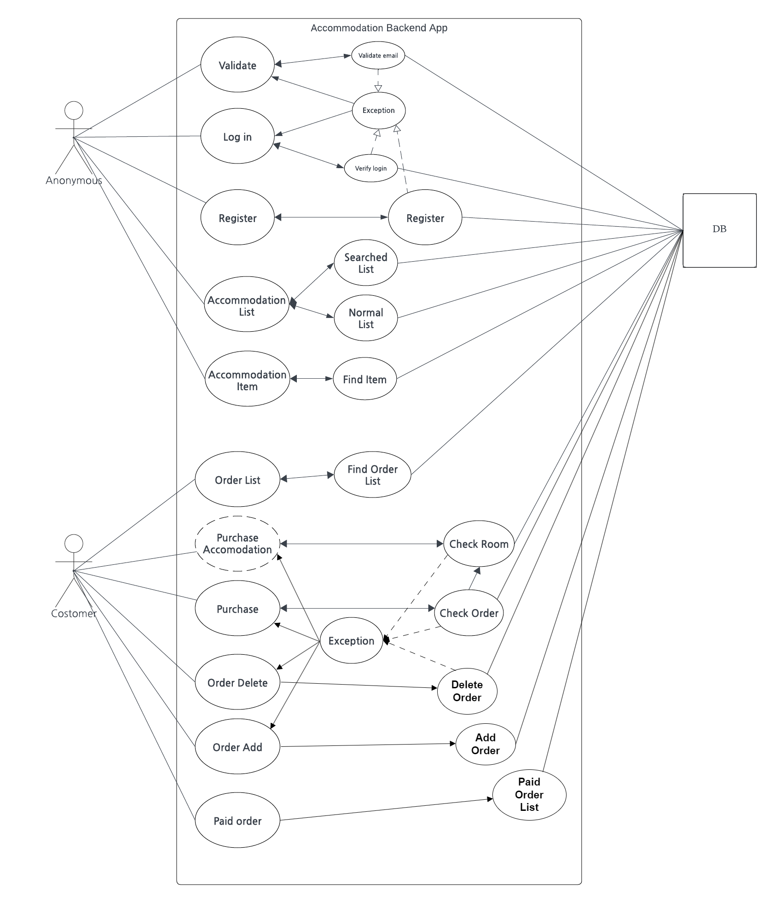
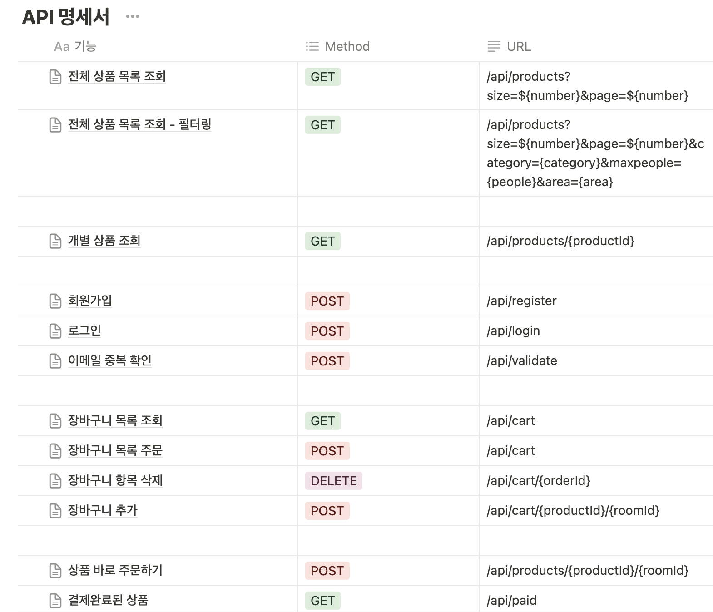
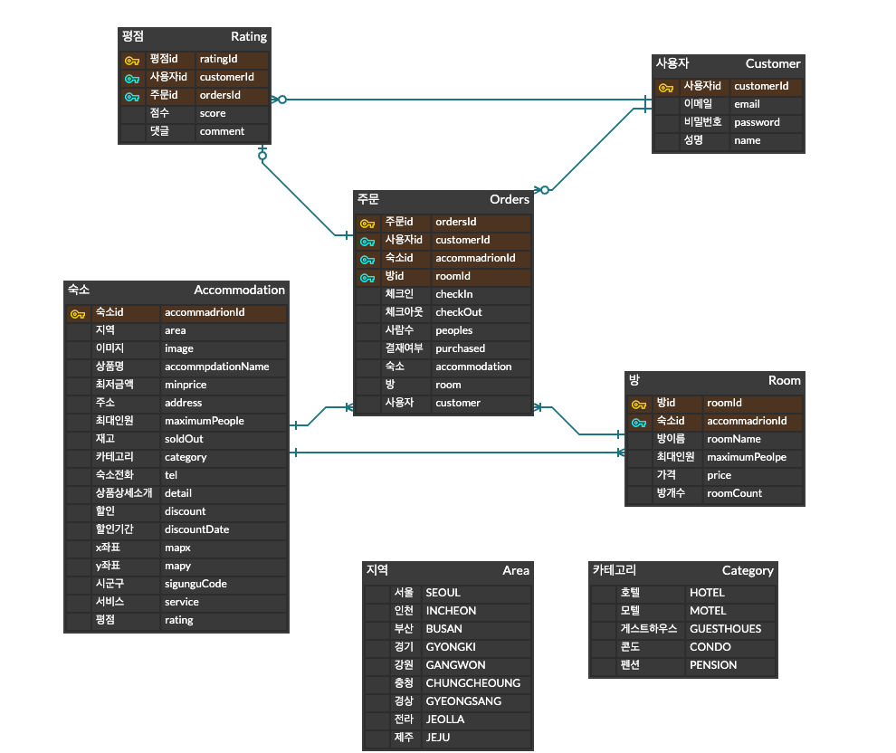

# **💒 숙박 / 예약 서비스 만들기**

### KPT 기간 업데이트
- CI/CD 구현 Testing 브랜치로 진행

## 💻 프로젝트 소개

* 프로젝트 url
  [fcbe-mini-project.kro.kr:8080](fcbe-mini-project.kro.kr:8080)

* 제작기간 : 2024.03.18 ~ 2024.04.05  
* 제작인원 : FE_3명, BE_3명

국내 여행을 하고 싶을때 제일 중요한 숙박시설입니다. 이때 필요한 **'HYUBANG'** 숙박시설을 지역 또는 숙박 형태로 원하는 조건에 맞게 숙박시설을 검색 할 수 있습니다.

## 🕹️ 개발 환경 (Back-End)
### 개발도구
* 배포 : EC2
* 언어 : Java 17
* DB : MySQL
* 프레임워크 : SpringBoot with Gradle
* Library
  - Lombok
  - jwt
  - SpringSecurity
  - QueryDsl

### 개발관리
- Slack
- Zoom
- Discode

## 👩‍💻 팀원 소개 (BackEnd)
|    권재현    |   https://github.com/Galmaeki    |
|:---------:|:--------------------------------:|
|  **김애림**  | **https://github.com/aelimited** |
| **김지안** |  **https://github.com/twonabi**  |

## 📖 Use Case

## 📨 api 명세서
노션 링크 : https://www.notion.so/API-8b0d2fc8f3474d1982b99a9d3ca345ec

## 🗄️ ERD

## 프로젝트 상세 구현내용
#### **[필수 구현사항]**
- 회원가입
  - 회원은 회원가입을 할 수 있습니다.
  - 기본 정보는 ID 역할로 이메일 주소와, 비밀번호, 이름 입니다.
- 회원 로그인 기능
  - 이메일과 비밀번호로 로그인할 수 있습니다.
  - 회원 정보를 저장해둔 데이터베이스를 검색하여 해당 사용자가 유효한 사용자 인지 판단합니다.
  - 상품 조회(전체, 개별), 회원 가입은 로그인 없이 사용 가능합니다.
  - 이 외 기능은 로그인이 필요합니다.
- 전체 상품 목록 조회
  - 데이터베이스에서 전체 상품 목록을 가져옵니다.
  - 이미지, 상품명, 상품가격을 기본으로 출력합니다.
  - 재고에 따라 품절일 경우, 출력 여부에 대해선 팀별로 결정합니다.
  - 한 페이지에 출력되는 상품 개수는 팀별로 정하여, 페이징을 수행합니다.
- 개별 상품 조회
  - 전체 상품 목록에서 특정 상품 이미지를 클릭하면,
  - 해당 상품에 대한 상세 정보를 상품에 저장해 둔 데이터베이스에서 가져옵니다.
  - 이미지, 상품명, 상품가격, 상품 상세 소개 (1줄 이상)을 기본으로 출력합니다.
  - 재고에 따라 품절일 경우, 화면 구성은 팀별로 결정합니다.
- 상품 옵션 선택
  - 상품 상세 소개 페이지에서 상품 옵션을 선택할 수 있습니다.
  - 날짜, 숙박 인원은 기본으로 포함됩니다.
  - 이 외 룸 형태 등 필요한 요소는 팀별로 기획합니다.
- 결제하기
  - 주문 페이지에서 결제하기 버튼을 클릭하면, 실제 결제 로직 및 절차 없이 상품을 바로 주문한 것으로 처리합니다.
  - 주문을 저장하는 데이터베이스에 주문 정보를 저장합니다.
- 주문 결과 확인
  - 결제를 성공적으로 처리하면, 주문한 상품(들)에 대한 주문 결과를 출력해줍니다.

### **[선택 구현사항]**
- 전체 상품 목록 조회
  - 카테고리를 분류하여, 상품을 출력할 수도 있습니다.
- 장바구니 담기
  - 장바구니에 담긴 상품 데이터 (이미지, 상품명, 옵션 등)에 따른 상품별 구매 금액, 전체 주문 합계 금액 등을 화면에 출력합니다.
  - 체크 박스를 통해 결제할 상품을 선택/제외할 수도 있습니다.
  - 주문하기 버튼을 통해 주문/결제 화면으로 이동합니다.
- 주문 내역 확인
  - 별도 주문 내역 페이지에 여태 주문한 모든 이력을 출력해줍니다.
# Toy3_project
# Toy3_project
